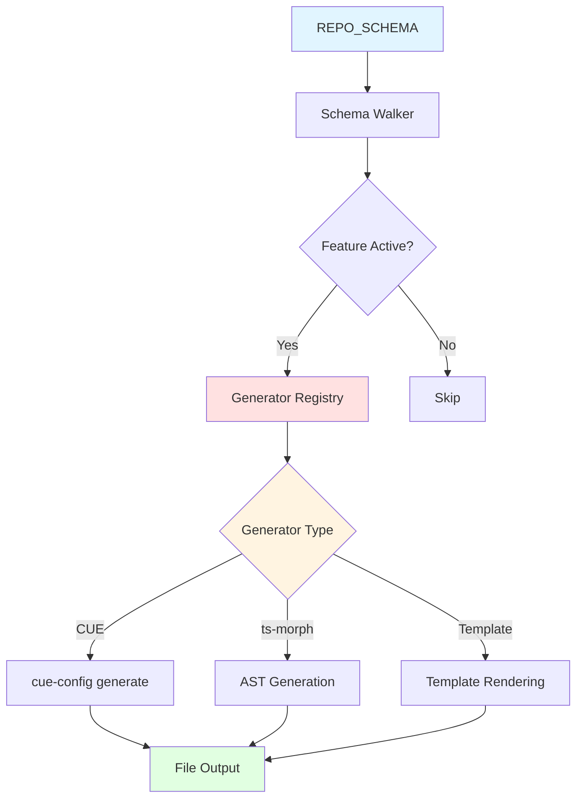
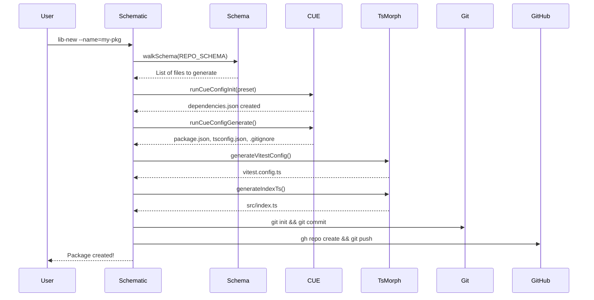
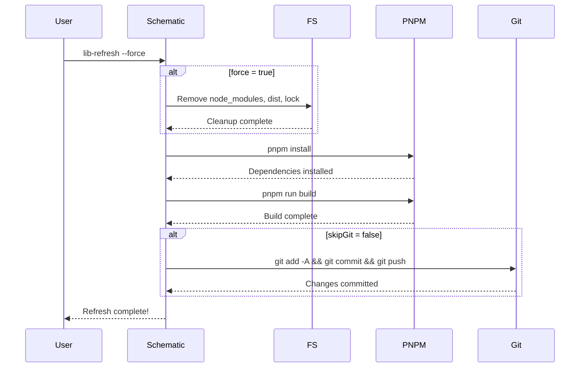

# @mark1russell7/scaffold


Schema-driven scaffolding system with Angular Schematics, ts-morph AST generation, and CUE configuration for automated package creation and management.

## Overview

`scaffold` is a comprehensive **code generation framework** that uses a declarative schema to define package structure and automatically generates all necessary files. It combines:

- **Schema-Driven Architecture**: Single source of truth (REPO_SCHEMA) defines all package structure
- **Type-Safe Generators**: TypeScript enforces that every file in the schema has a generator
- **Multiple Generation Backends**: CUE, ts-morph, and template-based generation
- **Feature System**: Dependency-aware feature flags control which files are generated
- **Angular Schematics**: High-level workflows for package creation and maintenance

### Key Benefits

- **No Manual File Creation**: All files generated from schema + generators
- **Compile-Time Guarantees**: TypeScript errors if generators are missing
- **Consistent Package Structure**: Every package follows the same pattern
- **Feature Composition**: Features automatically pull in their dependencies
- **Workflow Automation**: Schematics handle multi-step operations (init, generate, git, etc.)

## Architecture



### System Components

```
┌─────────────────────────────────────────────────────────────────┐
│  Angular Schematics (High-Level Workflows)                      │
│  - lib-new: Create new package with full setup                  │
│  - lib-refresh: Refresh package (install, build, commit)        │
└───────────────────────────────┬─────────────────────────────────┘
                                │
┌───────────────────────────────▼─────────────────────────────────┐
│  Schema Layer                                                   │
│  - REPO_SCHEMA: Canonical package structure definition          │
│  - Feature System: Dependency-aware feature flags               │
│  - Validators: Type-safe registry enforcement                   │
└───────────────────────────────┬─────────────────────────────────┘
                                │
┌───────────────────────────────▼─────────────────────────────────┐
│  Generator Registry (Type-Enforced)                             │
│  - Maps every file path to a generator function                 │
│  - TypeScript errors if any file lacks a generator              │
└───────────────────────────────┬─────────────────────────────────┘
                                │
┌───────────────────────────────▼─────────────────────────────────┐
│  Generator Backends                                             │
│  - CUE: package.json, tsconfig.json, .gitignore                 │
│  - ts-morph: vitest.config.ts, src/index.ts                     │
│  - Template: dependencies.json                                  │
└─────────────────────────────────────────────────────────────────┘
```

## Installation

```bash
# Using pnpm (recommended)
pnpm add @mark1russell7/scaffold

# Using npm
npm install @mark1russell7/scaffold

# Via GitHub (development)
pnpm add github:mark1russell7/scaffold#main
```

## Quick Start

### Using Schematics (Recommended)

```bash
# Create a new package
npx @angular-devkit/schematics-cli @mark1russell7/scaffold:lib-new \
  --name=my-package \
  --preset=lib \
  --rootPath=~/git

# Refresh an existing package
npx @angular-devkit/schematics-cli @mark1russell7/scaffold:lib-refresh \
  --packagePath=/path/to/my-package \
  --packageName=my-package \
  --force
```

### Programmatic Usage

```typescript
import {
  REPO_SCHEMA,
  walkSchema,
  resolveFeatures,
  generators,
  FSType,
  Feature
} from "@mark1russell7/scaffold";

// Resolve features for a preset
const features = resolveFeatures("lib");
// Set<Feature> { Feature.Core, Feature.NPM, Feature.TS, Feature.Cue, Feature.Vitest }

// Walk the schema to find files to generate
walkSchema(REPO_SCHEMA, "", (path, metadata, node) => {
  if (metadata.type === FSType.File) {
    // Check if feature is active
    if (!metadata.feature || features.has(metadata.feature)) {
      console.log(`Generate: ${path}`);

      // Get the generator for this file
      const generator = generators[path];
      if (generator) {
        const content = await generator(path, {
          packageName: "my-package",
          fullPackageName: "@mark1russell7/my-package",
          features,
          preset: "lib",
          rootPath: "/path/to/packages"
        });
        // Write content to file
      }
    }
  }
});
```

## Core Concepts

### 1. Schema Definition (REPO_SCHEMA)

The schema is the **single source of truth** for package structure:

```typescript
export const REPO_SCHEMA = {
  [METADATA_KEY]: {
    type: FSType.Directory,
    name: "{{packageName}}",
  },

  "package.json": {
    [METADATA_KEY]: {
      type: FSType.File,
      generator: Generator.Cue,
      feature: Feature.NPM,
      cueExpr: "npm/package:output",
    },
  },

  "tsconfig.json": {
    [METADATA_KEY]: {
      type: FSType.File,
      generator: Generator.Cue,
      feature: Feature.TS,
      cueExpr: "ts/config:output",
    },
  },

  "vitest.config.ts": {
    [METADATA_KEY]: {
      type: FSType.File,
      generator: Generator.TsMorph,
      feature: Feature.Vitest,
      morphFn: "generateVitestConfig",
    },
  },

  src: {
    [METADATA_KEY]: {
      type: FSType.Directory,
      always: true,
    },

    "index.ts": {
      [METADATA_KEY]: {
        type: FSType.File,
        generator: Generator.TsMorph,
        feature: Feature.TS,
        morphFn: "generateIndexTs",
      },
    },
  },
} as const satisfies SchemaNode;
```

### 2. Type-Safe Generator Registry

Adding a file to the schema **requires** adding a generator, enforced by TypeScript:

```typescript
// This object MUST have an entry for every file in REPO_SCHEMA
// Missing entries cause TypeScript compile errors!
export const generators = createGeneratorRegistry(REPO_SCHEMA, {
  "package.json": cueGenerator("npm/package:output"),
  "tsconfig.json": cueGenerator("ts/config:output"),
  ".gitignore": cueGenerator("git/ignore:output"),
  "dependencies.json": templateGenerator("dependencies.json.ejs"),
  "vitest.config.ts": generateVitestConfig,
  "src/index.ts": generateIndexTs,
  // TypeScript ERROR if any file path is missing!
});
```

### 3. Feature System

Features control which schema nodes are active and handle dependencies:

```typescript
// Feature definitions with dependencies
const featureConfig = {
  features: {
    git: { dependencies: [] },
    npm: { dependencies: ["git"] },
    ts: { dependencies: ["npm"] },
    react: { dependencies: ["ts"] },
    vitest: { dependencies: ["ts"] },
    cue: { dependencies: ["npm"] },
  },
  presets: {
    lib: ["ts", "cue", "vitest"],          // TypeScript library
    "react-lib": ["react", "cue", "vitest"], // React component library
    app: ["vite-react", "cue", "vitest"],   // Full application
  },
};

// Resolve features with dependencies
const features = resolveFeatures("lib");
// Returns: Set { Feature.Core, Feature.NPM, Feature.TS, Feature.Cue, Feature.Vitest }
// Note: NPM and git dependencies were auto-included!
```

## API Reference

### Schema Types

#### `FSType`

Filesystem node types:

```typescript
enum FSType {
  File = "file",
  Directory = "directory",
}
```

#### `Generator`

Available generator backends:

```typescript
enum Generator {
  /** CUE evaluation (package.json, tsconfig.json, .gitignore) */
  Cue = "cue",
  /** ts-morph AST generation (TypeScript files) */
  TsMorph = "ts-morph",
  /** EJS/Handlebars templates */
  Template = "template",
  /** No generation needed (directories, manual files) */
  None = "none",
}
```

#### `Feature`

Feature flags for conditional generation:

```typescript
enum Feature {
  Core = "core",        // Always included
  NPM = "npm",          // NPM package management
  TS = "ts",            // TypeScript
  Vitest = "vitest",    // Vitest testing
  React = "react",      // React
  Node = "node",        // Node.js specific
  Vite = "vite",        // Vite bundler
  Cue = "cue",          // CUE config
  NodeCJS = "node-cjs", // CommonJS
  ViteReact = "vite-react", // Vite + React
}
```

#### `SchemaNode`

Node in the schema tree:

```typescript
interface SchemaNode {
  [METADATA_KEY]: NodeMetadata;
  [key: string]: SchemaNode | NodeMetadata;
}

type NodeMetadata = FileMetadata | DirectoryMetadata;

interface FileMetadata {
  type: FSType.File;
  generator: Generator;
  feature?: Feature;
  morphFn?: string;      // For Generator.TsMorph
  cueExpr?: string;      // For Generator.Cue
  template?: string;     // For Generator.Template
}

interface DirectoryMetadata {
  type: FSType.Directory;
  name?: string;
  feature?: Feature;
  always?: boolean;
}
```

#### `GeneratorContext`

Context passed to generator functions:

```typescript
interface GeneratorContext {
  packageName: string;        // e.g., "scaffold"
  fullPackageName: string;    // e.g., "@mark1russell7/scaffold"
  features: Set<Feature>;     // Active features
  preset: string;             // e.g., "lib"
  rootPath: string;           // Package root path
}
```

#### `GeneratorFn`

Generator function signature:

```typescript
type GeneratorFn = (
  path: string,
  context: GeneratorContext
) => Promise<string> | string;
```

### Schema Functions

#### `walkSchema()`

Walk the schema tree and call a visitor for each node:

```typescript
function walkSchema(
  node: SchemaNode,
  currentPath: string,
  visitor: (path: string, metadata: NodeMetadata, node: SchemaNode) => void
): void;

// Example
walkSchema(REPO_SCHEMA, "", (path, metadata, node) => {
  console.log(`${path}: ${metadata.type}`);
  if (metadata.type === FSType.File) {
    console.log(`  Generator: ${metadata.generator}`);
  }
});
```

#### `getFilePaths()`

Get all file paths from the schema:

```typescript
function getFilePaths(schema: SchemaNode): string[];

// Example
const files = getFilePaths(REPO_SCHEMA);
// ["package.json", "tsconfig.json", ".gitignore", "dependencies.json",
//  "vitest.config.ts", "src/index.ts"]
```

#### `getDirectoryPaths()`

Get all directory paths from the schema:

```typescript
function getDirectoryPaths(schema: SchemaNode): string[];

// Example
const dirs = getDirectoryPaths(REPO_SCHEMA);
// ["src", "src/__tests__"]
```

#### `createGeneratorRegistry()`

Create a type-safe generator registry:

```typescript
function createGeneratorRegistry<TSchema extends SchemaNode>(
  schema: TSchema,
  generators: GeneratorRegistry<TSchema>
): GeneratorRegistry<TSchema>;

// Example
const generators = createGeneratorRegistry(REPO_SCHEMA, {
  "package.json": cueGenerator("npm/package:output"),
  "tsconfig.json": cueGenerator("ts/config:output"),
  // TypeScript ERROR if any file is missing!
});
```

#### `validateRegistry()`

Runtime validation of generator registry:

```typescript
function validateRegistry(
  schema: SchemaNode,
  registry: Record<string, GeneratorFn>
): { valid: boolean; missing: string[]; extra: string[] };

// Example
const result = validateRegistry(REPO_SCHEMA, generators);
if (!result.valid) {
  console.error("Missing generators:", result.missing);
  console.error("Extra generators:", result.extra);
}
```

### Feature Functions

#### `resolveFeatures()`

Resolve all features including dependencies for a preset:

```typescript
function resolveFeatures(preset: string): Set<Feature>;

// Example
const features = resolveFeatures("lib");
// Set { Feature.Core, Feature.NPM, Feature.TS, Feature.Cue, Feature.Vitest }
```

#### `isFeatureActive()`

Check if a feature is active:

```typescript
function isFeatureActive(
  feature: Feature | undefined,
  activeFeatures: Set<Feature>
): boolean;

// Example
const features = resolveFeatures("lib");
if (isFeatureActive(Feature.Vitest, features)) {
  // Generate vitest config
}
```

#### `getPresets()`

Get all available presets:

```typescript
function getPresets(): string[];

// Example
const presets = getPresets();
// ["lib", "react-lib", "app"]
```

#### `getPresetFeatures()`

Get features for a specific preset:

```typescript
function getPresetFeatures(preset: string): string[];

// Example
const features = getPresetFeatures("lib");
// ["ts", "cue", "vitest"]
```

#### `setFeatureConfig()` / `getFeatureConfig()`

Manage feature configuration:

```typescript
function setFeatureConfig(config: FeatureConfig): void;
function getFeatureConfig(): FeatureConfig;

// Example
setFeatureConfig({
  features: {
    custom: { dependencies: ["ts"] },
  },
  presets: {
    "custom-preset": ["custom", "vitest"],
  },
});
```

### Generator Functions

#### `cueGenerator()`

Create a CUE-based generator:

```typescript
function cueGenerator(cueExpr: string): GeneratorFn;

// Example
const packageJsonGen = cueGenerator("npm/package:output");
const content = await packageJsonGen("package.json", context);
```

#### `runCueConfigInit()`

Run `cue-config init` to initialize a package:

```typescript
async function runCueConfigInit(cwd: string, preset: string): Promise<void>;

// Example
await runCueConfigInit("/path/to/package", "lib");
// Creates dependencies.json with preset's features
```

#### `runCueConfigGenerate()`

Run `cue-config generate` to create config files:

```typescript
async function runCueConfigGenerate(cwd: string): Promise<void>;

// Example
await runCueConfigGenerate("/path/to/package");
// Generates package.json, tsconfig.json, .gitignore
```

#### `templateGenerator()`

Create a template-based generator:

```typescript
function templateGenerator(templateName: string): GeneratorFn;

// Example
const depsGen = templateGenerator("dependencies.json.ejs");
const content = await depsGen("dependencies.json", context);
```

#### `registerTemplate()`

Register a custom template:

```typescript
function registerTemplate(
  name: string,
  generator: (context: GeneratorContext) => string
): void;

// Example
registerTemplate("custom.json", (context) => {
  return JSON.stringify({ name: context.packageName }, null, 2);
});
```

#### `generateVitestConfig()`

Generate vitest.config.ts using ts-morph:

```typescript
const generateVitestConfig: GeneratorFn;

// Example
const config = await generateVitestConfig("vitest.config.ts", context);
// Returns TypeScript source code for vitest config
```

#### `generateIndexTs()`

Generate src/index.ts entry point:

```typescript
const generateIndexTs: GeneratorFn;

// Example
const index = await generateIndexTs("src/index.ts", context);
// Returns TypeScript source with package header comment
```

#### `generateTestFile()`

Generate a basic test file:

```typescript
const generateTestFile: GeneratorFn;

// Example
const test = await generateTestFile("src/__tests__/index.test.ts", context);
// Returns vitest test boilerplate
```

#### `generateRegisterTs()`

Generate register.ts for procedure packages:

```typescript
const generateRegisterTs: GeneratorFn;

// Example
const register = await generateRegisterTs("src/register.ts", context);
// Returns procedure registration boilerplate
```

#### `getGenerator()`

Get a generator by path from the registry:

```typescript
function getGenerator(path: string): GeneratorFn | undefined;

// Example
const gen = getGenerator("package.json");
if (gen) {
  const content = await gen("package.json", context);
}
```

## Angular Schematics

### lib-new

Create a new package with complete scaffolding.

#### Schema

```json
{
  "name": {
    "type": "string",
    "description": "Package name (without @mark1russell7/ prefix)",
    "pattern": "^[a-z][a-z0-9-]*$"
  },
  "preset": {
    "type": "string",
    "description": "Feature preset to use",
    "default": "lib",
    "enum": ["lib", "react-lib", "app"]
  },
  "rootPath": {
    "type": "string",
    "description": "Root directory for packages",
    "default": "~/git"
  },
  "skipGit": {
    "type": "boolean",
    "description": "Skip git init and GitHub repo creation",
    "default": false
  },
  "skipManifest": {
    "type": "boolean",
    "description": "Skip adding to ecosystem manifest",
    "default": false
  }
}
```

#### Usage

```bash
# CLI
npx @angular-devkit/schematics-cli @mark1russell7/scaffold:lib-new \
  --name=my-package \
  --preset=lib \
  --rootPath=~/git

# Programmatic
import { libNew } from "@mark1russell7/scaffold/schematics/lib-new";

const rule = libNew({
  name: "my-package",
  preset: "lib",
  rootPath: "~/git",
});
```

#### Workflow



The schematic performs these steps:

1. **Process Schema Tree**: Walk REPO_SCHEMA, create directories, identify files to generate
2. **CUE Initialization**: Run `cue-config init --preset <preset>`
3. **CUE Generation**: Run `cue-config generate` to create config files
4. **ts-morph Generation**: Generate TypeScript files (vitest.config.ts, src/index.ts)
5. **Structure Validation**: Run `cue-config validate-structure`
6. **Git Initialization**: `git init`, `git add -A`, `git commit`
7. **GitHub Repository**: Create repo with `gh repo create`, push to remote
8. **Ecosystem Manifest**: Add package entry to ecosystem.manifest.json

### lib-refresh

Refresh an existing package (cleanup, install, build, commit).

#### Schema

```json
{
  "packagePath": {
    "type": "string",
    "description": "Absolute path to the package to refresh"
  },
  "packageName": {
    "type": "string",
    "description": "Name of the package"
  },
  "force": {
    "type": "boolean",
    "description": "Force full cleanup (rm node_modules, dist, lock)",
    "default": false
  },
  "skipGit": {
    "type": "boolean",
    "description": "Skip git commit/push",
    "default": false
  },
  "dryRun": {
    "type": "boolean",
    "description": "Preview changes without applying",
    "default": false
  }
}
```

#### Usage

```bash
# CLI
npx @angular-devkit/schematics-cli @mark1russell7/scaffold:lib-refresh \
  --packagePath=/path/to/my-package \
  --packageName=my-package \
  --force

# Programmatic
import { libRefresh, getRefreshResults } from "@mark1russell7/scaffold/schematics/lib-refresh";

const rule = libRefresh({
  packagePath: "/path/to/my-package",
  packageName: "my-package",
  force: true,
  dryRun: false,
});

// Get results after execution
const results = getRefreshResults();
// [
//   { step: "cleanup", success: true, message: "Deleted: node_modules/, dist/" },
//   { step: "install", success: true, message: "pnpm install succeeded" },
//   { step: "build", success: true, message: "pnpm run build succeeded" },
//   { step: "git", success: true, message: "Committed and pushed changes" }
// ]
```

#### Workflow



The schematic performs these steps:

1. **Cleanup** (if `force`): Remove `node_modules/`, `dist/`, `pnpm-lock.yaml`, `.tsbuildinfo`
2. **Install**: Run `pnpm install`
3. **Build**: Run `pnpm run build`
4. **Git Operations** (if not `skipGit`):
   - Check for changes with `git status --porcelain`
   - Stage: `git add -A`
   - Commit: `git commit -m "Refreshed package"`
   - Push: `git push`

## Package Structure

```
scaffold/
├── src/
│   ├── schema/                    # Schema definitions and types
│   │   ├── index.ts              # Schema module exports
│   │   ├── types.ts              # Core type definitions
│   │   ├── metadata.ts           # Metadata key constant
│   │   ├── repo-schema.ts        # REPO_SCHEMA definition
│   │   └── validators.ts         # Type-safe validation utilities
│   ├── generators/               # Generator implementations
│   │   ├── index.ts              # Generator module exports
│   │   ├── cue.ts                # CUE generator
│   │   ├── ts-morph.ts           # ts-morph AST generators
│   │   ├── template.ts           # Template generator
│   │   └── registry.ts           # Type-enforced generator registry
│   ├── features/                 # Feature system
│   │   └── index.ts              # Feature resolution and presets
│   ├── schematics/               # Angular Schematics
│   │   ├── lib-new/
│   │   │   ├── index.ts          # lib-new schematic implementation
│   │   │   └── schema.json       # lib-new JSON schema
│   │   └── lib-refresh/
│   │       ├── index.ts          # lib-refresh schematic implementation
│   │       └── schema.json       # lib-refresh JSON schema
│   └── index.ts                  # Main exports
├── schematics/                   # Compiled schematics output
│   └── schematics/
│       ├── collection.json       # Schematics collection manifest
│       ├── lib-new/
│       │   ├── index.js          # Compiled lib-new schematic
│       │   └── schema.json       # lib-new schema
│       └── lib-refresh/
│           ├── index.js          # Compiled lib-refresh schematic
│           └── schema.json       # lib-refresh schema
├── dist/                         # Compiled TypeScript output
├── package.json
├── tsconfig.json
└── README.md
```

## Use Cases

### 1. Create a Standard Library Package

```typescript
import { libNew } from "@mark1russell7/scaffold/schematics/lib-new";

// Create a TypeScript library with vitest
await libNew({
  name: "my-utils",
  preset: "lib",
  rootPath: "~/git",
});

// Generates:
// - package.json (CUE)
// - tsconfig.json (CUE)
// - .gitignore (CUE)
// - dependencies.json (template)
// - vitest.config.ts (ts-morph)
// - src/index.ts (ts-morph)
// - src/__tests__/ (directory)
// + git init, commit, GitHub repo
```

### 2. Create a React Component Library

```typescript
await libNew({
  name: "my-components",
  preset: "react-lib",
  rootPath: "~/git",
});

// Includes all "lib" files PLUS:
// - React-specific tsconfig
// - React dependencies in package.json
// - Example component structure
```

### 3. Extend the Schema

```typescript
// 1. Add to REPO_SCHEMA
const CUSTOM_SCHEMA = {
  ...REPO_SCHEMA,
  "README.md": {
    [METADATA_KEY]: {
      type: FSType.File,
      generator: Generator.Template,
      feature: Feature.Core,
      template: "readme.md.ejs",
    },
  },
};

// 2. TypeScript now REQUIRES adding to generator registry
const generators = createGeneratorRegistry(CUSTOM_SCHEMA, {
  // ... existing generators
  "README.md": templateGenerator("readme.md.ejs"), // TypeScript ERROR if missing!
});

// 3. Register the template
registerTemplate("readme.md.ejs", (context) => {
  return `# ${context.fullPackageName}\n\nGenerated package.`;
});
```

### 4. Custom Feature Set

```typescript
// Define custom features
setFeatureConfig({
  features: {
    ...getFeatureConfig().features,
    graphql: { dependencies: ["ts"] },
    apollo: { dependencies: ["graphql", "react"] },
  },
  presets: {
    ...getFeatureConfig().presets,
    "graphql-lib": ["apollo", "vitest"],
  },
});

// Use custom preset
const features = resolveFeatures("graphql-lib");
// Set { Feature.Core, Feature.NPM, Feature.TS, Feature.React,
//       Feature.Vitest, Feature.GraphQL, Feature.Apollo }
```

### 5. Programmatic Package Generation

```typescript
import {
  REPO_SCHEMA,
  walkSchema,
  generators,
  resolveFeatures,
  FSType
} from "@mark1russell7/scaffold";
import { writeFileSync, mkdirSync } from "fs";
import { join } from "path";

async function generatePackage(
  name: string,
  preset: string,
  rootPath: string
) {
  const features = resolveFeatures(preset);
  const packagePath = join(rootPath, name);

  const context = {
    packageName: name,
    fullPackageName: `@mark1russell7/${name}`,
    features,
    preset,
    rootPath: packagePath,
  };

  // Walk schema and generate all files
  walkSchema(REPO_SCHEMA, "", async (path, metadata) => {
    if (metadata.type === FSType.Directory) {
      const dirPath = join(packagePath, path);
      mkdirSync(dirPath, { recursive: true });
    } else if (metadata.type === FSType.File) {
      // Check feature
      if (metadata.feature && !features.has(metadata.feature)) {
        return; // Skip
      }

      // Generate content
      const generator = generators[path];
      if (generator) {
        const content = await generator(path, context);
        const filePath = join(packagePath, path);
        writeFileSync(filePath, content);
        console.log(`Generated: ${path}`);
      }
    }
  });
}

await generatePackage("my-lib", "lib", "~/git");
```

## Integration with Ecosystem

### With Mark CLI

The Mark CLI uses scaffold for `lib new` command:

```typescript
// mark-cli/src/commands/lib/new.ts
import { libNew } from "@mark1russell7/scaffold/schematics/lib-new";

export async function libNewCommand(options: { name: string; preset: string }) {
  await libNew({
    name: options.name,
    preset: options.preset,
    rootPath: "~/git",
  });
}
```

### With cue-config

Scaffold delegates config file generation to `@mark1russell7/cue`:

```mermaid
graph LR
    A[scaffold] -->|runCueConfigInit| B[@mark1russell7/cue]
    A -->|runCueConfigGenerate| B
    B -->|Outputs| C[package.json]
    B -->|Outputs| D[tsconfig.json]
    B -->|Outputs| E[.gitignore]
```

### With ts-morph

Scaffold uses ts-morph for AST-based TypeScript generation:

```typescript
import { Project } from "ts-morph";

export const generateIndexTs: GeneratorFn = async (_, context) => {
  const project = new Project({ useInMemoryFileSystem: true });
  const sourceFile = project.createSourceFile("index.ts");

  sourceFile.addStatements(`/**
   * ${context.fullPackageName}
   *
   * @packageDocumentation
   */

export {};
`);

  return sourceFile.getFullText();
};
```

## Development

### Building

```bash
pnpm install
pnpm build
```

The build process:

1. Compiles TypeScript: `tsc -b`
2. Compiles schematics: `tsc -p src/schematics/tsconfig.json`
3. Copies schema files: `cp src/schematics/*/schema.json schematics/schematics/*/`

### Type Checking

```bash
pnpm typecheck
```

### Cleaning Build Artifacts

```bash
pnpm clean
```

Removes:
- `dist/` - Compiled TypeScript
- `schematics/` - Compiled schematics
- `.tsbuildinfo` - TypeScript build cache

## Best Practices

### 1. Always Update Schema First

When adding new files to packages:

1. Add to `REPO_SCHEMA` in `src/schema/repo-schema.ts`
2. TypeScript will error in `src/generators/registry.ts`
3. Add the generator to fix the error

This ensures you never forget to create a generator!

### 2. Use Feature Flags Appropriately

```typescript
// Good: Optional feature
"vitest.config.ts": {
  [METADATA_KEY]: {
    type: FSType.File,
    generator: Generator.TsMorph,
    feature: Feature.Vitest, // Only if vitest is active
  },
}

// Good: Core file
"package.json": {
  [METADATA_KEY]: {
    type: FSType.File,
    generator: Generator.Cue,
    feature: Feature.NPM, // Always active for npm packages
  },
}

// Bad: No feature on optional file
"README.md": {
  [METADATA_KEY]: {
    type: FSType.File,
    generator: Generator.Template,
    // Missing feature! Will always be generated
  },
}
```

### 3. Prefer ts-morph for TypeScript

```typescript
// Good: Use ts-morph for type-safe generation
export const generateIndexTs: GeneratorFn = (_, context) => {
  const project = new Project({ useInMemoryFileSystem: true });
  const sourceFile = project.createSourceFile("index.ts");

  sourceFile.addImportDeclaration({
    moduleSpecifier: "./types",
    namedImports: ["MyType"],
  });

  return sourceFile.getFullText();
};

// Bad: String concatenation for TypeScript
export const generateIndexTs: GeneratorFn = (_, context) => {
  return `import { MyType } from "./types";\n`;
};
```

### 4. Keep Schematics Focused

Each schematic should do **one thing**:

- `lib-new`: Create new packages
- `lib-refresh`: Refresh existing packages
- Don't combine into a single schematic with mode flags

### 5. Test Schema Changes

After modifying the schema:

```bash
# Try generating a package
npx @angular-devkit/schematics-cli \
  @mark1russell7/scaffold:lib-new \
  --name=test-package \
  --preset=lib \
  --dry-run

# Check that all files are present
ls -la ~/git/test-package
```

## Troubleshooting

### TypeScript Errors in Generator Registry

If you see:
```
Property 'my-new-file.ts' is missing in type
```

You added a file to REPO_SCHEMA but didn't add it to the generator registry. Add the generator:

```typescript
export const generators = createGeneratorRegistry(REPO_SCHEMA, {
  // ... existing
  "my-new-file.ts": myNewGenerator,
});
```

### Schematic Not Found

If you see:
```
Schematic "lib-new" not found in collection "@mark1russell7/scaffold"
```

1. Check that schematics were built: `pnpm build`
2. Verify `schematics/schematics/collection.json` exists
3. Check `package.json` has `"schematics": "./schematics/schematics/collection.json"`

### Generator Returns Empty Content

If a generator produces empty files:

1. Check the generator function actually returns content
2. Verify the context has correct values
3. For CUE generators, check that the CUE expression is valid

### Feature Not Working

If a feature isn't activating files:

1. Check `resolveFeatures(preset)` includes your feature
2. Verify the feature and its dependencies are in `features.json`
3. Ensure the schema node has the correct `feature` field

## Related Packages

- [@mark1russell7/cue](https://github.com/mark1russell7/cue) - Configuration management via CUE
- [@mark1russell7/bundle-dev](https://github.com/mark1russell7/bundle-dev) - Development workflow bundle
- [@angular-devkit/schematics](https://www.npmjs.com/package/@angular-devkit/schematics) - Schematics framework
- [ts-morph](https://ts-morph.com/) - TypeScript AST manipulation

## License

MIT

## Contributing

Contributions welcome!

### Adding a New File to Packages

1. Add to `REPO_SCHEMA` in `src/schema/repo-schema.ts`
2. Add generator to `src/generators/registry.ts` (TypeScript will force you!)
3. Implement the generator if needed
4. Test with `lib-new --dry-run`

### Adding a New Feature

1. Add to `Feature` enum in `src/schema/types.ts`
2. Add to feature config in `src/features/index.ts`
3. Add dependencies if needed
4. Update presets as appropriate

### Adding a New Schematic

1. Create `src/schematics/my-schematic/index.ts`
2. Create `src/schematics/my-schematic/schema.json`
3. Add to `src/schematics/collection.json`
4. Update build script to copy schema.json

## Support

For issues, questions, or contributions:
- Open an issue on [GitHub](https://github.com/mark1russell7/scaffold)
- Review the source code for detailed implementation
- Check related packages for integration examples
